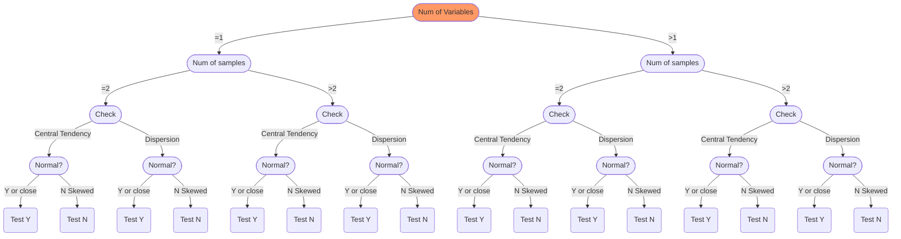

## Navigation Chart

```mermaid
graph TD
  vars([Num of Variables])
  S1([Num of samples])
  S2([Num of samples])
  S1Q2(["Check"])
  S1Q3(["Check"])
  S2Q2(["Check"])
  S2Q3(["Check"])
  S1Q2D(["Normal?"])
  S1Q2C(["Normal?"])
  S1Q3D(["Normal?"])
  S1Q3C(["Normal?"])
  S2Q2D(["Normal?"])
  S2Q2C(["Normal?"])
  S2Q3D(["Normal?"])
  S2Q3C(["Normal?"])
  S1Q2DY("Test Y")
  S1Q2DN("Test N")
  S1Q2CY("Test Y")
  S1Q2CN("Test N")
  S1Q3DY("Test Y")
  S1Q3DN("Test N")
  S1Q3CY("Test Y")
  S1Q3CN("Test N")
  S2Q2DY("Test Y")
  S2Q2DN("Test N")
  S2Q2CY("Test Y")
  S2Q2CN("Test N")
  S2Q3DY("Test Y")
  S2Q3DN("Test N")
  S2Q3CY("Test Y")
  S2Q3CN("Test N")

  vars:::orange -->|=1| S1
  vars -->|>1| S2
  S1 -->|=2| S1Q2
  S1 -->|>2| S1Q3
  S2 -->|=2| S2Q2
  S2 -->|>2| S2Q3
  S1Q2 -->|Central Tendency| S1Q2C
  S1Q2 -->|Dispersion| S1Q2D
  S1Q3 -->|Central Tendency| S1Q3C
  S1Q3 -->|Dispersion| S1Q3D
  S2Q2 -->|Central Tendency| S2Q2C
  S2Q2 -->|Dispersion| S2Q2D
  S2Q3 -->|Central Tendency| S2Q3C
  S2Q3 -->|Dispersion| S2Q3D
  S1Q2C -->|Y or close| S1Q2CY
  S1Q2C -->|N Skewed| S1Q2CN
  S1Q2D -->|Y or close| S1Q2DY
  S1Q2D -->|N Skewed| S1Q2DN
  S1Q3C -->|Y or close| S1Q3CY
  S1Q3C -->|N Skewed| S1Q3CN
  S1Q3D -->|Y or close| S1Q3DY
  S1Q3D -->|N Skewed| S1Q3DN
  S2Q2C -->|Y or close| S2Q2CY
  S2Q2C -->|N Skewed| S2Q2CN
  S2Q2D -->|Y or close| S2Q2DY
  S2Q2D -->|N Skewed| S2Q2DN
  S2Q3C -->|Y or close| S2Q3CY
  S2Q3C -->|N Skewed| S2Q3CN
  S2Q3D -->|Y or close| S2Q3DY
  S2Q3D -->|N Skewed| S2Q3DN

  classDef orange fill:#f96;
```
