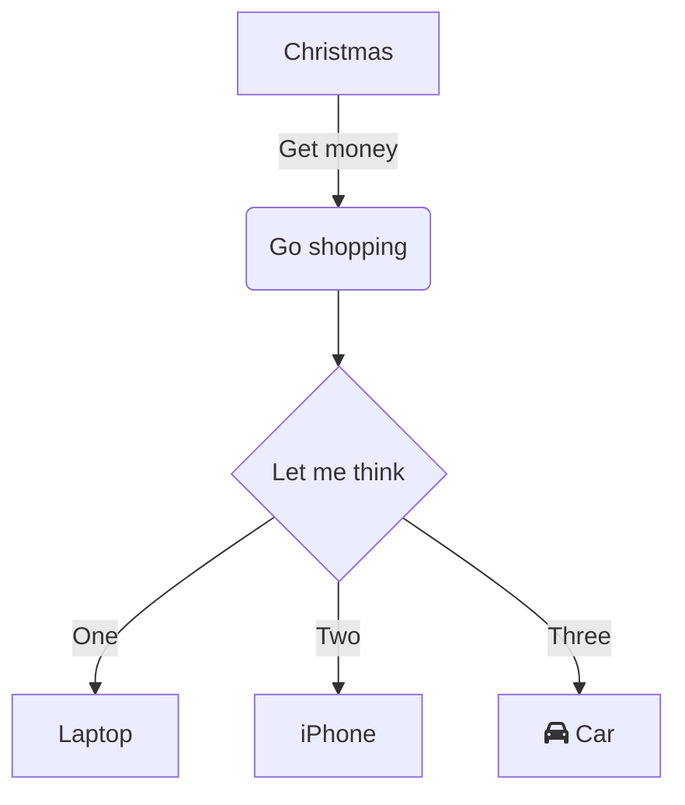
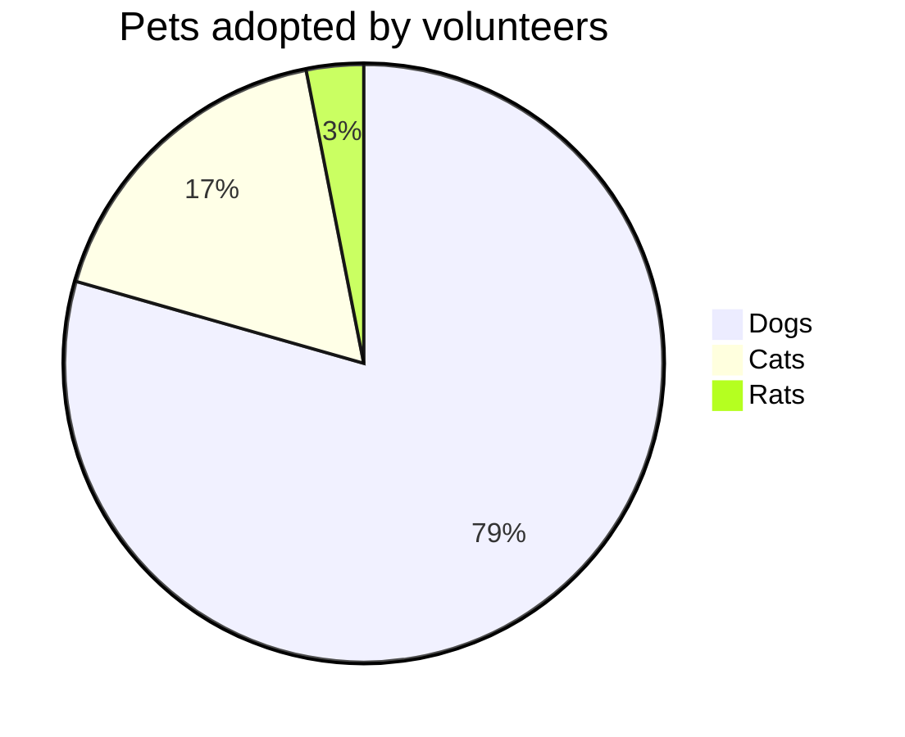

## Math Jax Demo

When $$a \ne 0$$, there are two solutions to $$ax^2 + bx + c = 0$$ and they are
$$x_1 = {-b + \sqrt{b^2-4ac} \over 2a}$$
$$x_2 = {-b - \sqrt{b^2-4ac} \over 2a} \notag$$

## Flow Chart


## Pie Chart



## Demo Chart

```chart
{
  "type": "bubble",
  "data": {
    "datasets": [
      {
        "label": "First Dataset",
        "data": [
          {
            "x": 20,
            "y": 30,
            "r": 15
          },
          {
            "x": 40,
            "y": 10,
            "r": 10
          }
        ],
        "backgroundColor": "#FF6384",
        "hoverBackgroundColor": "#FF6384"
      }
    ]
  },
  "options": {}
}
```